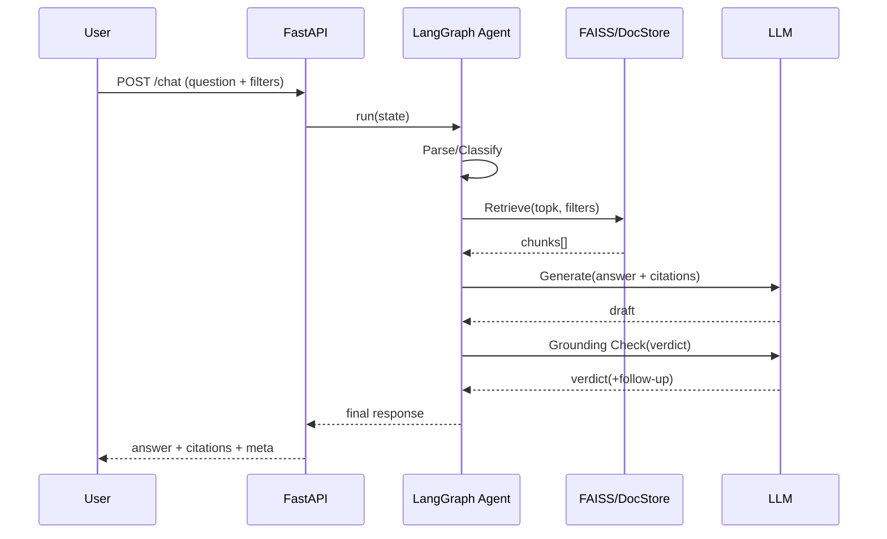

# PRD: StoreOps Agentic RAG MVP (FAISS + LangGraph)

## 1) 배경 / 문제정의
오프라인 매장 운영(환불/프로모션/재고/CS)은 규정이 복잡하고 빈번히 변경된다. 담당자(점장/스태프)는 즉시 정확한 답을 얻기 어렵고, LLM 단독 응답은 근거 부족/환각(Hallucination) 위험이 있다.  
따라서 **근거 문서 기반(RAG) + 안전장치(근거 인용 강제, 모르면 보류) + 작업 흐름(Agent)**가 필요하다.

---

## 2) 목표(Goals)
- 매장 운영 관련 질문에 대해 **근거 문서 기반 답변**을 제공한다.
- **LangGraph** 기반으로 `분류 → 검색 → 생성 → 근거검증 → 확정` 흐름을 구성한다.
- 최소한의 운영 요소(로그/캐시)와 평가 지표를 포함해 **“운영 가능한 시스템”** 형태로 제시한다.

---

## 3) 비목표(Non-goals)
- 멀티테넌시, 권한/SSO, 대규모 분산 인덱스/샤딩
- POS/재고 시스템 등 외부 시스템 실연동(도구 호출은 mock 수준)
- 고급 Reranker/Cross-Encoder 최적화(시간 남으면 옵션)

---

## 4) 타겟 사용자 / 시나리오
- **매장 스태프/점장**: “환불 가능한 기간은?”, “이번 주 프로모션 적용 조건은?”
- **운영 관리자**: “정책 버전별 차이”, “최신 규정이 무엇인지”

---

## 5) 핵심 사용자 스토리(User Stories)
1. 사용자는 질문을 입력하면 **정확한 답변 + 근거(문서명/발췌)**를 받는다.
2. 근거가 부족하면 시스템은 **추가 질문을 하거나 답변을 보류**한다.
3. 사용자는 `store_type`, `category`, `effective_date` 등 컨텍스트로 검색 범위를 좁힐 수 있다.

---

## 6) 성공 기준(Acceptance Criteria / KPI)
- **Citation rate**: 전체 응답 중 95% 이상이 근거 인용 포함
- **Retrieval hit@5**: 골든셋 기준 0.75 이상(튜닝 후 0.85 목표)
- **Latency (p95)**: 2초 이내(로컬 기준, 측정 기준은 README에 명시)
- **Fail-safe**: 근거 부족 시 단정 금지(추가 질문/보류) 100%

---

## 7) UX / 응답 정책
### 응답 포맷
- 요약 답변(3~5문장)
- 근거 인용 2~3개: `[doc_title] - snippet`
- 필요 시 follow-up 질문 1개

### 정책
- **근거 없으면 단정 금지**
- 근거가 상충하면 “상충”을 명시하고 `effective_date/버전` 기준으로 최신 우선

---

## 8) 시스템 설계(High-level)

### 8.1 구성요소
- API: **FastAPI**
- Indexing: 문서 로더 → Chunking → Embedding → **FAISS**
- Agent Orchestration: **LangGraph**
- Storage:
  - FAISS index(벡터)
  - DocStore(JSON/SQLite): chunk text + metadata + version

### 8.2 문서/메타데이터 스키마(예시)
- `doc_id`, `title`, `category` (refund/promo/inventory/cs)
- `store_type` (cafe/convenience/apparel)
- `version`, `valid_from`, `valid_to`
- `chunk_id`, `chunk_text`, `source_path`

### 8.3 Retrieval 파이프라인(MVP)
1) query normalize  
2) metadata filter(optional): store_type/category/effective_date  
3) FAISS similarity topK(기본 8)  
4) (옵션) light rerank(간단 스코어링) 후 top 5 사용  

---

## 9) LangGraph 설계(Agent 그래프) — 상세

### 9.3 Agent 설계 목표(Design Principles)
- **Grounded First**: 답변은 반드시 검색된 근거(chunk)에서만 생성한다. (근거 없으면 단정 금지)
- **Fail-safe**: 근거가 부족하거나 상충하면 `추가 질문` 또는 `답변 보류`로 전환한다.
- **Controlled Loop**: 재검색/재생성 루프는 최대 1회로 제한해 비용/지연 폭주를 막는다.
- **Measurable**: 각 노드별 latency/결과를 기록해 eval 및 디버깅 가능하게 한다.

### 9.4 State 정의(권장: 상세)
(간단 State 예시를 실제 구현 가능한 형태로 확장)

- `trace_id: str` (요청 단위 추적)
- `question: str`
- `filters: {store_type?: str, category?: str, effective_date?: str, language?: str}`
- `parsed: {normalized_query: str, intent?: str, confidence?: float}`
- `retrieval: {topk: int, applied_filters: dict, candidates: list, selected: list}`
- `draft: {answer: str, citations: list}`
- `grounding: {verdict: "pass"|"insufficient"|"conflict"|"off_topic", issues: list[str], follow_up_question?: str}`
- `final: {answer: str, citations: list, follow_up_question?: str}`
- `counters: {retrieval_attempts: int, generation_attempts: int, max_retries: int}`
- `metrics: {latency_total_ms: int, latency_by_node_ms: dict}`
- `errors: list[str]`

### 9.5 Nodes 상세(입력/출력/정책)

#### (1) Parse/Classify Node
**입력**
- `question`, `filters(optional)`

**처리**
- normalized_query 생성 (불필요 표현 제거, 핵심 키워드 유지)
- intent 추론 (예: `policy_lookup`, `how_to`, `exception`, `unknown`)
- category/store_type/effective_date 힌트 추출 (없으면 null)
- confidence 산출(대략)

**출력**
- `parsed.normalized_query`, `parsed.intent`, `filters(보강 가능)`

**실패 정책**
- confidence가 낮으면(예: <0.5) 필터를 강하게 걸지 않고 broad retrieval로 진행

#### (2) Retrieve Node (Tool: FAISS)
**입력**
- `parsed.normalized_query`, `filters`, `topk` (기본 8~10)

**처리**
- metadata filter 적용(store_type/category/effective_date)
- FAISS로 후보 검색
- 같은 doc이 과도하게 점유하지 않도록 `max_chunks_per_doc=2` 같은 제한 적용(선택)

**출력**
- `retrieval.candidates` (최대 topk 후보)
- `retrieval.applied_filters`

**실패 정책**
- candidates가 0이면: `need_clarification` 플로우로 전환

#### (3) Generate Node
**입력**
- `retrieval.selected` (또는 candidates 상위 N개)

**처리**
- 답변 3~5문장 생성
- citation 2~3개 강제(문서명 + snippet)
- “근거 없으면 모른다고 말하기” 강제

**출력**
- `draft.answer`, `draft.citations`

**실패 정책**
- JSON 파싱/포맷 실패 시 1회 재시도(그래도 실패하면 에러로 finalize)

#### (4) Grounding Check Node (핵심)
**입력**
- `draft.answer`, `draft.citations`, `retrieval.selected`

**검증 항목(MVP)**
- **Citation Presence**: citations 2개 이상인가?
- **Evidence Coverage**: 답변의 핵심 주장(기간/조건/예외)이 snippet에 존재하는가?
- **Conflict**: citations 사이에 상충되는 조건이 있는가? (예: 환불 7일 vs 14일)

**출력**
- `grounding.verdict`:
  - `pass`: 그대로 finalize
  - `insufficient`: 재검색 또는 추가 질문
  - `conflict`: “상충됨” 안내 + effective_date/최신 버전 기준으로 정리 or 추가 질문
  - `off_topic`: 질문 의도와 검색 문서가 어긋남 → 재검색(키워드 확장)

#### (5) Finalize Node
**입력**
- `draft` 또는 `grounding` 결과

**처리**
- 최종 응답 스키마로 정리
- meta(지표/trace_id/재시도 횟수) 포함

**출력**
- API Response(JSON)

### 9.6 분기/루프 정책(Decision Rules)
- `retrieval.candidates == []` → Clarify(추가 질문) 또는 Abstain(보류)
- `grounding.verdict == "pass"` → Finalize
- `grounding.verdict in ["insufficient","off_topic"]`:
  - `retrieval_attempts < 2` 이면 **재검색 1회 허용**
  - 아니면 Clarify/Abstain
- `grounding.verdict == "conflict"`:
  - effective_date가 있으면 해당 날짜 기준으로 우선 적용
  - 없으면 최신 version 우선 + “상충” 안내 + follow-up 질문 1개

### 9.7 Agent 흐름도(Flowchart)
> 아래 mermaid는 README/PRD에 넣으면 면접관도 바로 이해함

```mermaid
flowchart TD
    A[Start: /chat request] --> B[Parse/Classify]
    B --> C[Build/Normalize Query + Fill Filters]
    C --> D[Retrieve: FAISS + metadata filter]
    D -->|no results| H[Clarify/Abstain]
    D --> E[Generate Answer + Citations]
    E --> F[Grounding Check]
    F -->|pass| G[Finalize Response]
    F -->|insufficient/off_topic| I{retrieval_attempts < 2?}
    I -->|yes| D2[Re-Retrieve (relax filters/topk+2)] --> E
    I -->|no| H
    F -->|conflict| J[Conflict Handling + Follow-up]
    J --> G
```

---

## 10) API 스펙(MVP)

### POST `/chat`
#### Request
```json
{
  "question": "환불 규정 알려줘",
  "store_type": "cafe",
  "category": "refund",
  "effective_date": "2025-12-01",
  "language": "ko"
}
```

#### Response
```json
{
  "answer": "카페 매장 구매 건은 구매일로부터 7일 이내 환불이 가능하며, 사용/훼손된 상품은 제한될 수 있습니다. 프로모션/세트 상품은 일부 예외가 적용될 수 있으니 구매 형태를 확인해 주세요.",
  "citations": [
    {
      "doc_id": "refund_policy_v2",
      "title": "환불 정책 v2",
      "chunk_id": "refund_policy_v2#03",
      "snippet": "환불은 구매일로부터 7일 이내 가능하며, 사용 또는 훼손 시 환불이 제한될 수 있다.",
      "score": 0.82
    },
    {
      "doc_id": "refund_exception",
      "title": "환불 예외 규정",
      "chunk_id": "refund_exception#01",
      "snippet": "프로모션/세트 상품의 경우 환불 조건이 상이할 수 있으며, 구매 채널에 따라 정책이 달라진다.",
      "score": 0.77
    }
  ],
  "follow_up_question": "구매 채널이 매장 결제인지(오프라인) 앱 결제인지 알려주실 수 있나요?",
  "meta": {
    "trace_id": "b7d2c8f1-...",
    "topk": 8,
    "retrieval_attempts": 1,
    "generation_attempts": 1,
    "latency_ms": 920,
    "verdict": "pass"
  }
}
```

```json
{
  "answer": "현재 보유한 정책 문서 근거만으로는 해당 상황의 환불 가능 여부를 확답하기 어렵습니다.",
  "citations": [],
  "follow_up_question": "구매일/구매 채널(매장/앱)과 상품 사용 여부를 알려주시면 정책 문서 근거로 다시 확인해 드릴게요.",
  "meta": {
    "trace_id": "0a1c...",
    "topk": 8,
    "retrieval_attempts": 2,
    "generation_attempts": 1,
    "latency_ms": 780,
    "verdict": "insufficient"
  }
}
```
- 근거 부족/오류

## 11) 시퀀스 다이어그램(요청-응답 관점)


## 12) 대표 실패 케이스 & 처리 정책
- 검색 결과 없음: 필터가 너무 좁을 수 있음 → (1회) 필터 완화 후 재검색, 그래도 없으면 follow-up 질문
- 정책 상충: 버전/유효기간 기준으로 우선순위 적용 + “상충” 명시
- 근거 부족: 단정 금지. “현재 문서로는 확답 불가” + 추가 질문 1개
- 프롬프트 인젝션(문서 내 지시문): 문서는 참고 자료이며 명령 수행 금지(시스템 정책에 명시)
